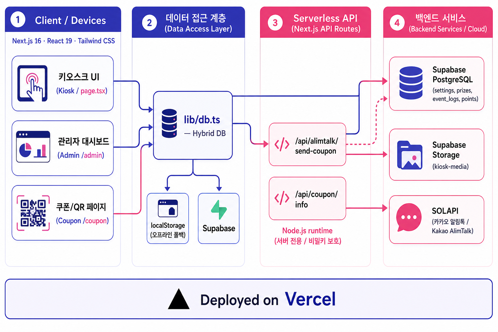

# 🎡 아시아드 볼링장 포트레이트 키오스크 이벤트 웹 애플리케이션 (Redsun)

이 프로젝트는 **Next.js (App Router)**와 **Supabase**를 기반으로 구축된 세로형(Portrait) 키오스크 이벤트용 웹 애플리케이션입니다. 볼링장이나 행사장 등에서 방문객들이 전면 키오스크 화면을 통해 전화번호를 입력하고 미니게임을 플레이하여 100% 당첨 경품(혹은 꽝)과 포인트를 얻는 실시간 이벤트 참여 환경을 제공합니다.

당첨 시 입력한 전화번호로 **카카오 알림톡(SOLAPI)**을 통해 쿠폰 번호와 당첨 안내가 자동 발송되며, 직원이 당첨된 쿠폰을 조회하고 차감할 수 있는 쿠폰 확인용 페이지 및 전체 시스템 설정을 관리하는 관리자 대시보드도 함께 내장되어 있습니다.

---

## 🏗️ 시스템 아키텍처



- **클라이언트(키오스크 / 관리자 / 쿠폰 페이지)** 는 `lib/db.ts`(데이터 접근 계층)를 통해 데이터를 다룹니다.
- `db.ts`는 **Supabase 연결 시 PostgreSQL·Storage**, **미연결 시 localStorage**를 사용하는 하이브리드 구조입니다.
- 비밀 키가 필요한 작업(알림톡 발송, 쿠폰 검증)만 **Next.js API Routes(서버 전용 런타임)** 로 분리했습니다.
- 포트폴리오용 상세 문서는 [`docs/PORTFOLIO.md`](./docs/PORTFOLIO.md)를 참고하세요.
- 화면 캡쳐가 포함된 기능 매뉴얼은 [`docs/MANUAL.md`](./docs/MANUAL.md)를 참고하세요.

---

## 🌟 주요 기능 및 특징

### 1. 사용자 키오스크 화면 (Kiosk Web UI)
- **전면 광고 배너(세로형)**: 키오스크 대기 상태(Landing) 시 관리자가 등록한 대형 이미지 배너와 타이틀/서브타이틀이 노출됩니다.
- **휴대폰 번호 입력 및 본인인증**: 중복 참여 방지(1인 1일 1회 참여 제한) 기능이 포함된 대형 터치 키패드 형태의 입력 창을 제공합니다.
- **미니게임 선택 및 진행**:
  - 🎡 **행운의 룰렛 (Roulette)**: 회전 후 지정된 확률에 맞춰 경품 당첨
  - 🎫 **스크래치 복권 (Scratch Card)**: 마우스나 터치로 직접 캔버스를 긁어서 경품을 확인하는 복권 게임
  - 🔍 **틀린그림찾기 (Spot Difference)**: 10가지 테마 이미지 중 랜덤 제시되는 두 그림의 다른 곳 3군데를 찾아내는 게임
  - 🎨 **숨은그림찾기 (Hidden Object)**: 이미지 내에 숨어 있는 특정 오브젝트들을 찾는 게임
- **당첨 결과 및 쿠폰 발급**:
  - 당첨 시 축하 꽃가루(Confetti) 이펙트와 함께 쿠폰 번호 제공
  - 모바일 기기 스캔용 QR 코드를 화면에 표시하여 쿠폰 다운로드 페이지 연결 및 이미지 저장을 유도

### 2. 백엔드 및 알림톡 시스템 (Backend & API)
- **하이브리드 데이터 저장(Dual Storage)**:
  - **Supabase 연결 시**: 실시간 DB 데이터 동기화 및 이미지 파일 스토리지 자동 업로드 지원
  - **Supabase 미연결 시 (로컬 데모)**: 브라우저의 `localStorage`를 가상 데이터베이스로 활용하여 서버 없이도 프론트엔드 단독으로 모든 기능(게임 플레이, 세팅 변경, 참여 로그 적재 등)이 정상 작동하는 편리한 데모 모드를 제공합니다.
- **카카오 알림톡 연동 (SOLAPI)**:
  - `/api/alimtalk/send-coupon`: 당첨 이벤트 발생 시, 백엔드 API가 SOLAPI 서버와 통신하여 등록된 템플릿 기반의 카카오 알림톡을 실시간으로 발송합니다.
  - 알림톡 발송 실패 또는 미설정 시 대체 SMS로 자동 전환 기능도 지원합니다.
- **쿠폰 검증 API**:
  - `/api/coupon/info`: 직원용 쿠폰 사용 처리(Redemption) 화면이나 QR 코드 스캔 시, 해당 쿠폰 코드가 유효한지 확인하고 경품 및 행사 타이틀 정보를 제공합니다.

### 3. 관리자 대시보드 (Admin Dashboard - `/admin`)
- **실시간 통계**: 당일 참여자 수, 쿠폰 사용율, 경품별 당첨 통계를 한눈에 시각화하여 확인 가능
- **이벤트 설정 변경**: 진행할 활성 미니게임 지정, 전면 광고 문구 수정 및 배너 이미지 업로드
- **경품 및 확률 관리**: 등록된 경품 이미지 업로드/수정, 당첨 확률 설정(합계 100% 유효성 체크) 지원
- **참여 로그 관리**: 참여자 휴대폰 번호, 당첨 경품, 쿠폰 코드, 쿠폰 사용 여부(`is_used`), 알림톡 발송 상태 확인 및 수동 쿠폰 사용 완료 처리 지원
- **포인트 관리**: 사용자 번호별 획득/차감 포인트 내역 조회 및 수동 포인트 추가/차감 조정 기능

---

## 📂 프로젝트 폴더 구조

```text
redsun/
├── .env.example              # 환경 변수 설정 템플릿 파일
├── schema.sql                # Supabase 데이터베이스 생성용 기본 SQL 스키마
├── supabase/                 # Supabase 추가 관련 쿼리 스크립트 폴더
│   ├── supabase-sql-editor.sql # Supabase 초기 설정에 유용한 통합 스크립트
│   ├── storage.sql           # 이미지 업로드용 Storage 버킷 설정
│   └── points.sql            # 포인트 기능 전용 테이블 설정
├── public/                   # 이미지, 아이콘, 폰트 등 정적 자원 파일
├── src/
│   ├── app/                  # Next.js App Router 페이지 및 API 라우트
│   │   ├── admin/            # 관리자 대시보드 페이지 (/admin)
│   │   ├── coupon/           # 고객용/직원용 쿠폰 사용 및 검증 페이지 (/coupon)
│   │   ├── api/              # 백엔드 Serverless API 라우트
│   │   │   ├── alimtalk/     # 카카오 알림톡 전송 API (/api/alimtalk/send-coupon)
│   │   │   └── coupon/       # 쿠폰 정보 확인 API (/api/coupon/info)
│   │   ├── layout.tsx        # 글로벌 레이아웃 및 폰트 로드 설정
│   │   └── page.tsx          # 키오스크 메인 화면 (루트 페이지)
│   ├── components/           # 공통 및 미니게임 컴포넌트
│   │   ├── admin/            # 관리자용 특화 컴포넌트 (BowlingDevGame, PointsManager)
│   │   ├── RouletteGame.tsx  # 룰렛 미니게임 컴포넌트
│   │   ├── ScratchCardGame.tsx # 스크래치 복권 게임 컴포넌트
│   │   ├── SpotDifferenceGame.tsx # 틀린그림찾기 게임 컴포넌트
│   │   ├── HiddenObjectGame.tsx # 숨은그림찾기 게임 컴포넌트
│   │   ├── PhoneNumberInput.tsx # 전화번호 입력 터치 키패드
│   │   └── KioskContainer.tsx # 세로형 키오스크 화면 규격 래퍼
│   ├── hooks/                # 커스텀 React 훅
│   ├── lib/                  # 비즈니스 로직 및 외부 라이브러리 연동
│   │   ├── db.ts             # Supabase ↔ localStorage 하이브리드 DB 인터페이스
│   │   ├── alimtalk.ts       # SOLAPI 알림톡 통신 유틸리티
│   │   ├── points.ts         # 포인트 시스템 연동 로직
│   │   └── supabase.ts       # Supabase 클라이언트 초기화 및 연결 상태 제어
│   └── middleware.ts         # Vercel Toolbar 주입 차단 및 요청 헤더 제어 미들웨어
└── package.json              # 프로젝트 의존성 및 스크립트 정의
```

---

## 🛠️ 개발 환경 설정 및 실행 방법

### 1. 패키지 설치
프로젝트 루트 폴더에서 아래 명령어로 의존성 패키지를 설치합니다:
```bash
npm install
```

### 2. 환경 변수 설정
`.env.example` 파일을 복사하여 `.env.local` 파일을 생성하고 필요한 값을 입력합니다:
```bash
cp .env.example .env.local
```
*(Supabase 연결 정보가 기입되지 않은 상태로 실행하면, 브라우저 로컬 스토리지에 데이터를 저장하는 `localStorage` 모드로 즉시 작동합니다.)*

#### 주요 환경 변수 설명:
- `NEXT_PUBLIC_SUPABASE_URL`: Supabase 프로젝트 URL
- `NEXT_PUBLIC_SUPABASE_ANON_KEY`: Supabase Anon(클라이언트용) 퍼블릭 키
- `SUPABASE_SERVICE_ROLE_KEY`: Supabase 서비스 역할 키 (관리자 백엔드 수정 권한 필요 시)
- `ALIMTALK_ENABLED`: 알림톡 발송 기능 활성화 여부 (`true`/`false`)
- `SOLAPI_API_KEY`, `SOLAPI_API_SECRET`: SOLAPI 서비스 계정 인증 정보
- `ALIMTALK_SENDER_FROM`: 발신 프로필 등록 전화번호
- `KAKAO_PF_ID`: 카카오톡 채널 프로필 아이디
- `KAKAO_TEMPLATE_ID`: 알림톡 발송에 사용할 검수 완료된 템플릿 코드

### 3. Supabase 데이터베이스 설정 (Supabase 사용 시)
1. Supabase 웹 콘솔에 접속한 후 새 프로젝트를 생성합니다.
2. **SQL Editor**에 접속하여 프로젝트 루트의 `schema.sql` 내용을 복사하여 실행합니다.
3. 이미지 저장을 위해 **Storage** 메뉴로 이동하여 `kiosk-media` 버킷을 생성하고 권한을 **Public**으로 설정합니다. (또는 `supabase/storage.sql` 스크립트 실행)
4. 포인트 기능 사용 시 `supabase/points.sql` 쿼리를 추가 실행합니다.

### 4. 로컬 서버 실행
개발 서버를 실행하여 기본 `3010` 포트에서 테스트할 수 있습니다:
```bash
npm run dev
```
브라우저를 열고 `http://localhost:3010` 주소로 접속하면 키오스크 화면을 바로 테스트할 수 있으며, `http://localhost:3010/admin`을 통해 관리자 페이지에 접근할 수 있습니다.

### 5. 빌드 및 배포
프로덕션 환경을 빌드하고 실행하려면 다음 명령을 실행합니다:
```bash
npm run build
npm run start
```
Vercel에 배포하여 운영할 경우 `vercel.json` 설정이 빌드 환경에 자동 대응됩니다.
