# 📖 아시아드 볼링장 키오스크 이벤트 — 기능 매뉴얼

이 문서는 키오스크 이벤트 웹앱의 화면별 기능을 **실제 화면 캡쳐**와 함께 설명하는 사용 매뉴얼입니다.

- 키오스크(고객) 주소: `http://localhost:3010`
- 관리자 주소: `http://localhost:3010/admin` (기본 비밀번호 `0077`)
- 쿠폰 다운로드 주소: `http://localhost:3010/coupon?c=쿠폰번호`

> 캡쳐 이미지는 `docs/screenshots/` 폴더에 저장되어 있으며, `node scripts/capture-screenshots.mjs`로 다시 생성할 수 있습니다. (dev 서버 실행 필요)

---

## 1부. 고객용 키오스크 화면

### 1) 대기/랜딩 화면

키오스크 대기 상태에서 노출되는 첫 화면입니다. 관리자가 등록한 광고 타이틀·배너 이미지가 표시되며, 하단의 **터치하여 시작하기** 버튼으로 참여를 시작합니다.

- 화면 하단에 `* 본 이벤트는 1인 1일 1회만 참여 가능합니다.` 안내 문구 노출
- 일정 시간 입력이 없으면 자동으로 이 화면으로 복귀

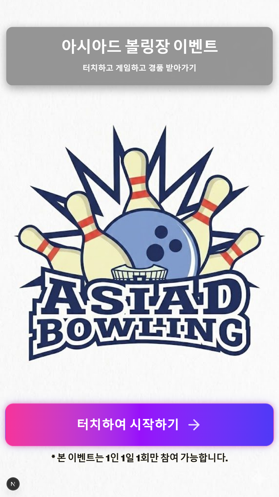

---

### 2) 본인인증 (휴대폰 번호 입력)

중복 참여 방지를 위해 휴대폰 번호를 입력하는 화면입니다.

- 대형 터치 키패드로 휴대폰 번호 11자리 입력 (`010-0000-0000` 형식 자동 표시)
- **[필수] 개인정보 수집·이용 동의** 체크 필요
- 번호 + 동의가 완료되면 **이벤트 참여하기** 버튼 활성화
- 같은 번호가 오늘 이미 참여했다면 "오늘 이미 참여하셨습니다" 안내 후 차단

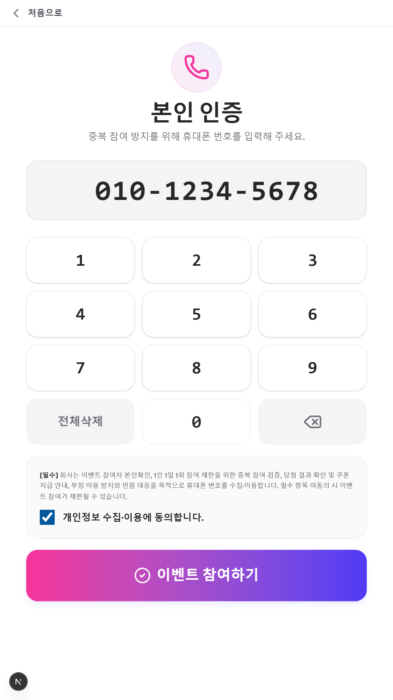

---

### 3) 게임 선택

참여할 미니게임을 고르는 화면입니다. 4종 중 하나를 선택합니다.

| 게임 | 설명 |
|------|------|
| 🎡 행운의 룰렛 | 돌려서 확률에 따라 경품 당첨 |
| 🎫 스크래치 복권 | 화면을 긁어서 경품 확인 |
| 🔍 틀린그림찾기 | 두 그림의 다른 곳 3군데 찾기 (10종 테마) |
| 🎨 숨은그림찾기 | 그림 속 숨은 물건 찾기 |

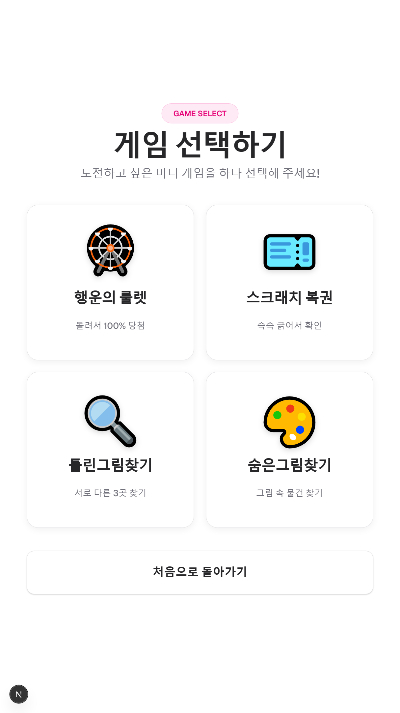

---

### 4) 게임 진행 (예: 행운의 룰렛)

선택한 미니게임이 실행됩니다. 아래는 룰렛 예시이며, 게임 종료 시 당첨 경품이 결정됩니다.

- 당첨 시 축하 효과(Confetti)와 함께 결과 화면으로 이동
- 결과 화면에서 쿠폰 번호와 QR 코드 제공
- 당첨 안내는 카카오 알림톡으로 발송(설정 시), 미발송 시 QR로 쿠폰 다운로드 안내

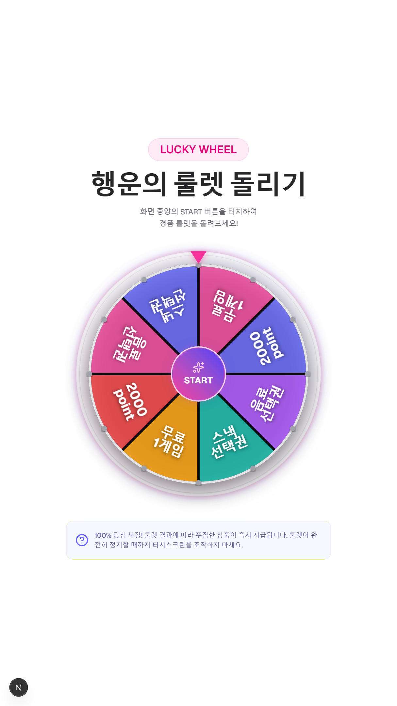

---

### 5) 쿠폰 다운로드 페이지

결과 화면의 QR을 휴대폰으로 스캔하면 열리는 페이지입니다. 쿠폰 번호가 담긴 이미지를 자동으로 저장합니다.

- 유효한 쿠폰: 쿠폰 이미지 자동 다운로드 + **다시 저장하기** 버튼
- 잘못된 쿠폰: "유효하지 않은 쿠폰입니다" 오류 표시

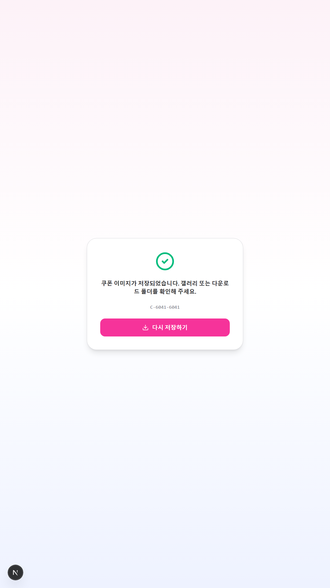

---

## 2부. 관리자 대시보드 (`/admin`)

### 6) 관리자 로그인

대시보드 진입 전 비밀번호(기본 `0077`)를 입력합니다.

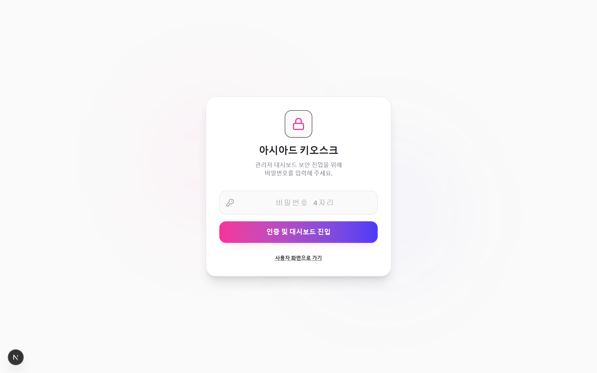

---

### 7) 이벤트 참여 현황

참여자의 실시간 기록을 조회·관리합니다.

- 기간(시작일/종료일), 연락처로 필터링 / 오늘·이번주·이번달 빠른 조회
- 참여 통계 카드(검색 결과 수, 오늘 참여자, 당첨 경품 종류)
- 목록: 연락처, 수집·이용 동의 상태, 당첨 경품, 쿠폰 번호, 알림톡 상태, 사용 여부, 참여 일시
- **CSV 다운로드** 지원

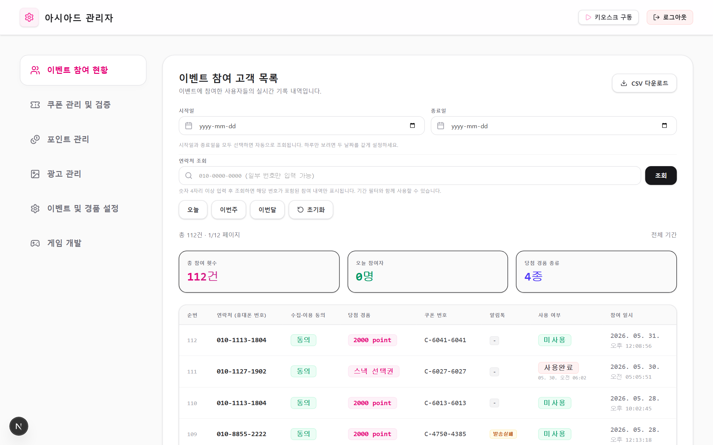

---

### 8) 쿠폰 관리 및 검증

직원이 고객의 쿠폰을 조회하고 사용 처리(차감)하는 화면입니다.

- 쿠폰 번호로 조회 → 경품/연락처/사용 여부 확인
- **사용 완료 처리** 시 포인트 자동 적립(경품명에 point가 있을 경우)

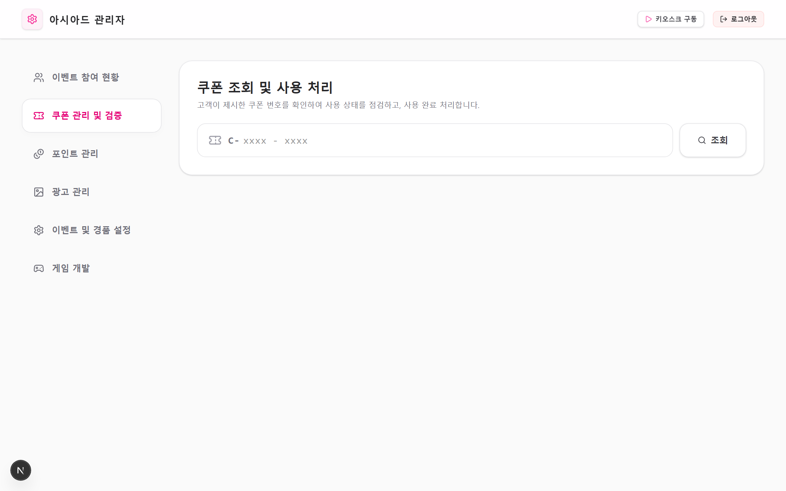

---

### 9) 포인트 관리

연락처(휴대폰)별 포인트 잔액과 거래 내역을 관리합니다.

- 등록 고객 수 / 총 보유 포인트 / 자동 적립 예시 요약
- **포인트 수동 조정**: 연락처·포인트·사유 입력 후 추가/차감
- 좌측: 연락처별 잔액·최종 변경 / 우측: 거래 내역(쿠폰 적립·관리자 지급·차감)
- 쿠폰 사용 시 경품명에 `point`가 있으면 자동 적립 (예: "2000 point" → +2,000P)

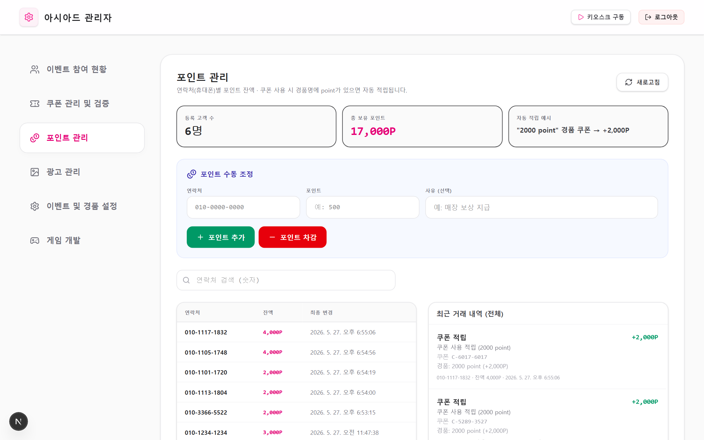

---

### 10) 광고 관리

랜딩 화면에 노출되는 광고 문구와 배너 이미지를 설정합니다.

- 광고 타이틀 / 서브타이틀 수정
- 배너 이미지 URL 입력 또는 파일 업로드(Supabase Storage 저장)

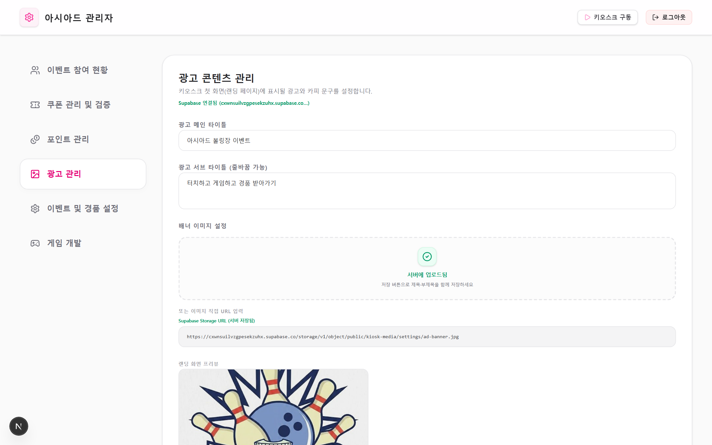

---

### 11) 이벤트 및 경품 설정

진행할 게임과 경품·당첨 확률을 관리합니다.

- 활성 미니게임 지정
- 경품 추가/수정, 이미지 업로드, 당첨 확률 설정(합계 100% 검증)

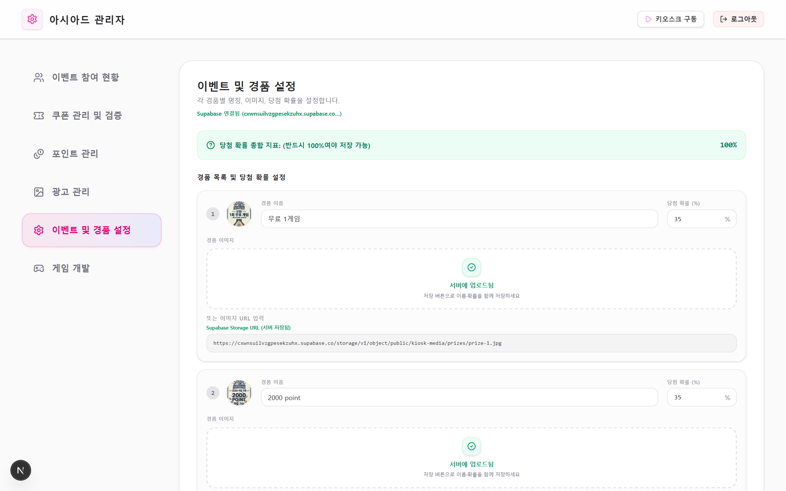

---

### 12) 게임 개발

운영 키오스크 흐름과 분리된, 관리자 전용 게임 테스트 공간입니다. (예: 볼링 미니게임)

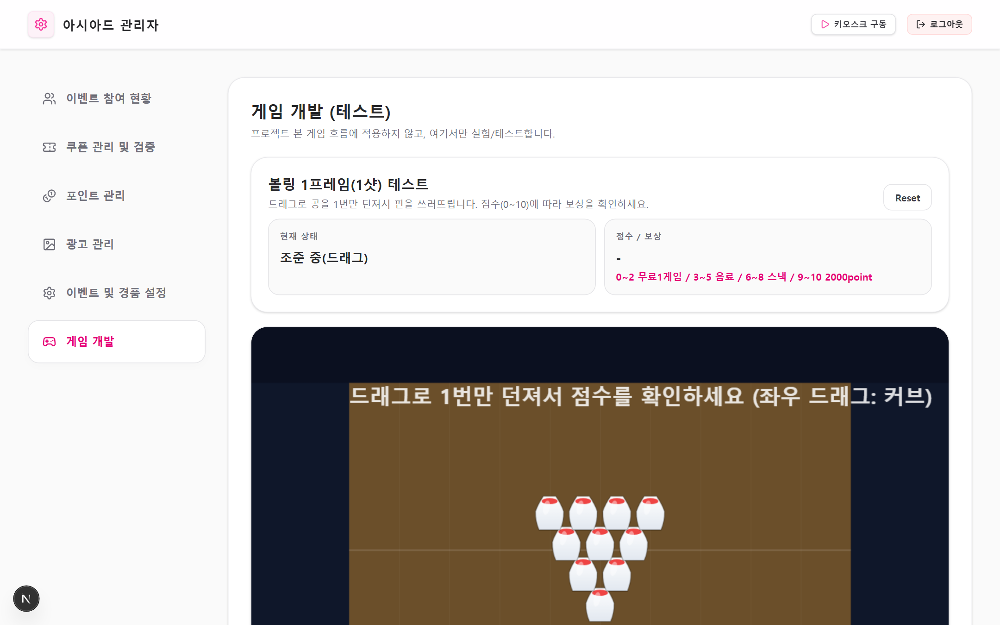

---

## 부록. 캡쳐 다시 생성하기

화면이 바뀌면 아래로 캡쳐를 갱신할 수 있습니다.

```bash
# 1) 개발 서버 실행 (포트 3010)
npm run dev

# 2) 다른 터미널에서 캡쳐 실행
node scripts/capture-screenshots.mjs
```

- 출력 위치: `docs/screenshots/*.png`
- 옵션: `KIOSK_BASE_URL`(기본 `http://localhost:3010`), `DEMO_COUPON`(쿠폰 페이지 캡쳐용 쿠폰 번호)
